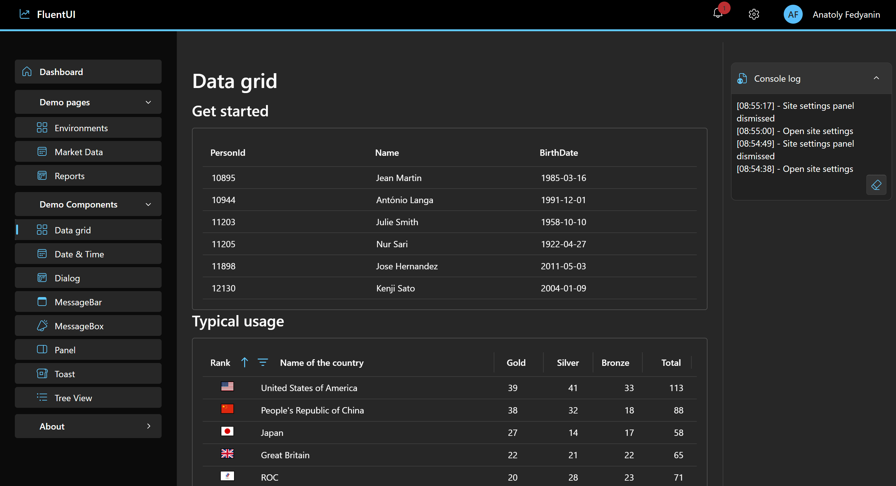

# blazor-fluentui-template

Plantilla de panel de control (Dashboard) para Blazor 8 basada en Fluent UI Blazor .NET (v8)



## Fluent UI Blazor

- [GitHub](https://github.com/microsoft/fluentui-blazor)
- [Demo y Documentación](https://www.fluentui-blazor.net/)

## Perspective Grid

- [Guía de usuario de JavaScript](https://perspective.finos.org/docs/js/)
- [GitHub](https://github.com/finos/perspective)
- [Ejemplo de simulación de mercado](https://prospective.co/blog/market-simulation)

### http-server para ejecutar ejemplos estáticos

La forma más sencilla es instalar http-server de forma global utilizando el administrador de paquetes de Node:

```
npm install -g http-server
```

Luego, simplemente ejecuta http-server en cualquier directorio de tu proyecto:

```
d:\my_project> http-server
```


## Recursos

- [Charla magistral: Hacia dónde va la tecnología web ahora - Steve Sanderson - NDC Porto 2023](https://www.youtube.com/watch?v=fIYYC_p_uU8)
- [Blazor WebAssembly .NET 7 frente a .NET 8: ¿Qué ha cambiado?](https://www.youtube.com/watch?v=2bEhiyqztwg)
- [Blazor WebAssembly con alojamiento en ASP.NET Core en .NET 8](https://www.youtube.com/watch?v=3Ur79_kHVpo)
